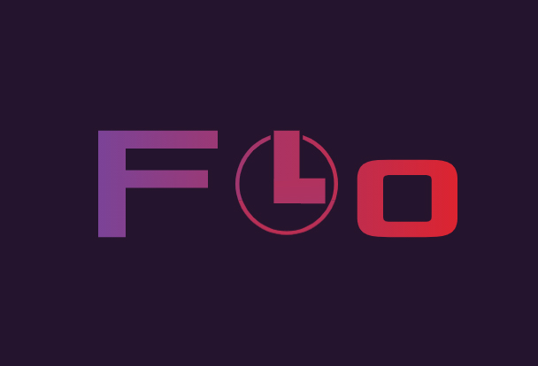
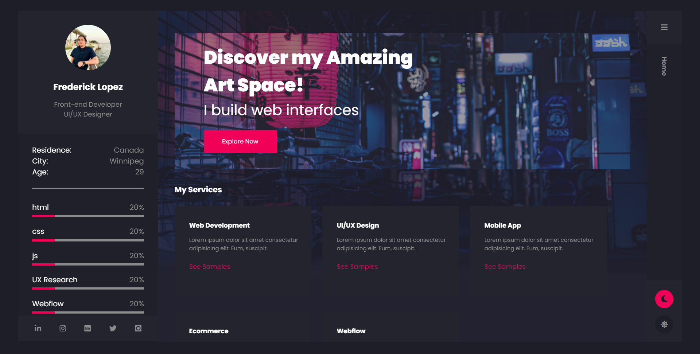

<br />
<div align="center">
  <a href="https://github.com/slickrickgit/frederick-lopez-portfolio">
    
  </a>

<h3 align="center">Portfolio Project</h3>

  <p align="center">
    Frederick Lopez
    <br />
    <a href="https://github.com/slickrickgit/frederick-lopez-portfolio"><strong>Explore the docs »</strong></a>
    <br />
    <br />
    <a href="www.fredericklopez.com">View Demo</a>
    ·
    <a href="https://github.com/slickrickgit/frederick-lopez-portfolio/issues/new">Report Bug</a>
  </p>
</div>


<br />
<br />

## Welcome to my portfolio



### Getting Started
👌Thanks for dropping in to my portfolio project repository.

⚠️Not all screen resolutions are handled yet. It might be on my second sprint release⚠️

💻For better viewing of content use 1536x754💻

💾Clone this repository by
```sh
  git clone https://github.com/slickrickgit/frederick-lopez-portfolio.git
   ```
🔌Install npm
 ```sh
   npm install
   ```
🏃 Run all npm build
 ```sh
   npm run build
   ```

### Introduction
This is my project portfolio created in HTML, CSS and JS. It showcase some of my sample works and projects as being a software developer student and a UX designer. The potfolio consist of the following pages:

* [Home](https://fredericklopez.com/)
* [Projects](https://fredericklopez.com/projects.html)
* [About](https://fredericklopez.com/about-me.html)
* [Contact](https://fredericklopez.com/contact.html)
* [Blog](https://fredericklopez.com/blog.html)

### Navigation
#### Left panel consist of the following elements
* Profile image
* Country of residence
* Skill progress bar
* Download my CV

#### Right panel 🍔 pop out menu is navigation through pages
</br>

### Planned Iteration
- [x] Deploy to netlify
- [ ] Add all media queries style to accommodate screen resolution
- [ ] View for 🌛 dark mode and 🌞light mode
- [ ] Include all the project content
- [ ] Add an actual blog post
- [ ] Fixed some trivial bugs

<p align="right">(<a href="#top">back to top</a>)</p>
